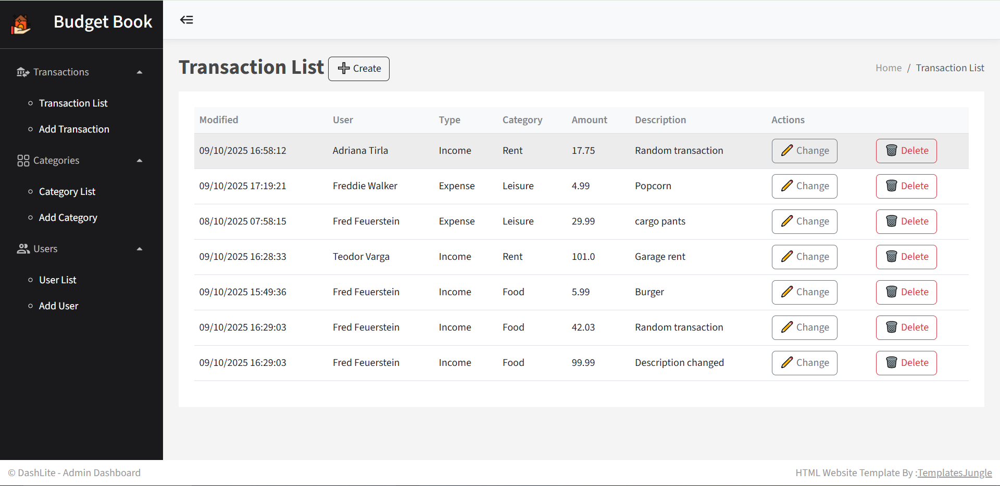
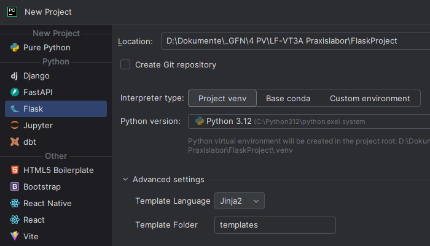
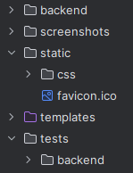
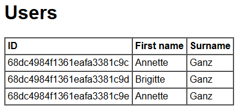
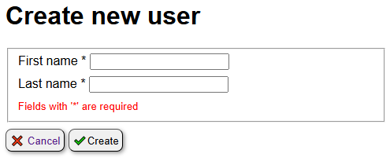
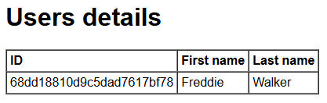
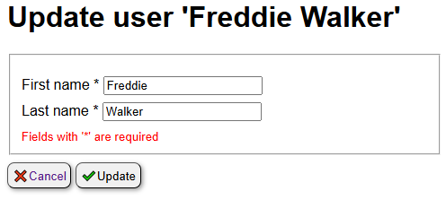
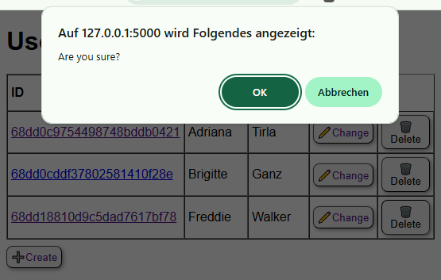
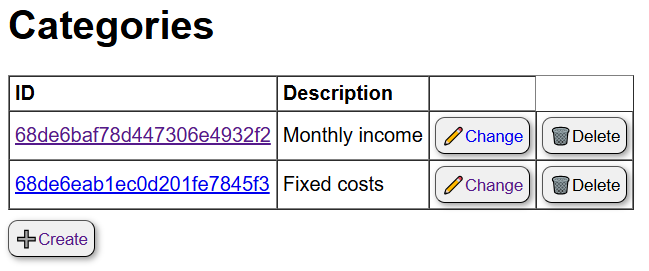

# Flask / Mongo tutorial

This project is meant to teach flask and MongoDB fundamentals by creating a **<u>budget book</u>**, step by step. <br/>
It uses the [Flask](https://flask.palletsprojects.com/en/stable/quickstart/) web framework, a [Bootstrap 5](https://getbootstrap.com) frontend and stores its data in [MongoDB](https://www.digitalocean.com/community/tutorials/how-to-use-mongodb-in-a-flask-application).<br>  
  

Follow these steps to implement the budget book:
## 1. Create project
1. In your IDE, create a new Flask project:<br/>


1. Create the following directory structure:<br/>
   

## 2. Database connection
1. [Download](https://www.mongodb.com/try/download/community) and install MongoDB.

1. Start MongoDB.  

1. Create a database connection script in [backend/db.py](backend/db.py):  
   ```python
   from flask_pymongo import PyMongo
   from flask import Flask
    
   mongo = PyMongo()
    
   def init_db(app: Flask):
     app.config["MONGO_URI"] = mongodb://localhost:27017/budgetbook"
     mongo.init_app(app)
     return mongo
   ```
1. In your [app.py](app.py), display the database connection:   
   ```python
   from flask import Flask
   from backend.db import init_db

   app = Flask(__name__)
   mongo = init_db(app)

   @app.route('/')
   def hello_world():
      return f"DB connection: {mongo.db}"

   if __name__ == '__main__':
      app.run()
   ``` 

## 3. Testing the database connection
1. Create a test class in [tests/backend/test_users.py](tests/backend/test_users.py).
   Connect to the database in [setUpClass()](tests/backend/test_users.py#:~:text=setUpClass)
   ```python
   @classmethod
   def setUpClass(cls):
      app = Flask(__name__)
      cls.mongo = init_db(app)
      cls.db = DbUsers(cls.mongo)
   ``` 
1. Close the database connection in [tearDownClass()](tests/backend/test_users.py#:~:text=tearDownClass)
   ```python
   @classmethod
   def tearDownClass(cls):
      cls.mongo.cx.close()
   ``` 
1. Write tests for the user's CRUD operations.

## 4. Displaying user entries
1. In the 'root' mapping of [app.py](app.py), load the users and render the corresponding HTML page.
   ```python
   @app.route('/')
   def root():
      users = dbUsers.read_all()
      return render_template('users/index.html', users=users)
   ``` 
 
1. Create a [index.html](templates/users/index.html) file in 'templates/users'.
 
1. Show the user entries in a table.
   ```html
   
      <tr>
         <td>{{ u._id }}</td>
         <td>{{ u.firstname }}</td>
         <td>{{ u.surname }}</td>
      </tr>
   
   ```
1. The result should look similar to this:<br>
   

## 5. CRUD operations for users
### 1. Create
1. Implement a new route to show the 'new user' form:
   ```python
   @app.route('/users/create', methods=['GET', 'POST'])
   def users_create():
      if request.method == 'GET':
         # show new_user creation form
         return render_template('users/create.html')
   ```
1. Implement the corresponding [create.html](templates/users/create.html) page:
   ```html
   ...
   <form action="/users/create" method="POST">
      <fieldset>
         <label for="firstname">First name *</label>
         <input type="text" name="firstname" id="firstname" required><br/>
         <label for="lastname">Last name *</label>
         <input type="text" name="lastname" id="lastname" required><br/>
         <small>Fields with '*' are required</small>
      </fieldset>
      <button type="button">
         <a href="/">❌ Cancel</a>
      </button>
      <button type="submit">✔️Create</button>
   </form>
   ```
   The result should look like this:<br>
      

1. Add a 'create' button in the [index.html](templates/users/index.html) page:
   ```html
   ...
    <button type="button">
        ➕<a href="/users/create">Create</a>
    </button>
   ```
1. In [app.py](app.py), add the code to handle the form submit. It takes the submitted values from the form,
   calls the backend, handles duplicates and finally redirects to the home page. 
   ```python
    if request.method == 'POST':
        firstname = request.form['firstname']
        lastname = request.form['lastname']
        user_id = dbUsers.create(firstname, lastname)

        if user_id is None:
            return f"User with name '{firstname + ' ' + lastname}' already exists", 409

        return redirect(url_for('root'))
   ```

### 2. Read
1. Implement a new route to display user details:
   ```python
    @app.route('/users/<user_id>')
    def users_read(user_id):
        user = dbUsers.read(user_id)
        if user is None:
            return f"User with ID '{user_id}' not found", 404
        return render_template('users/read.html', user=user)
   ```
1. Implement the corresponding [read.html](templates/users/read.html) page:
   ```html
   ...
   <table border cellpadding="4" cellspacing="0">
   <thead>
       <tr>
           <th>ID</th>
           <th>First name</th>
           <th>Last name</th>
       </tr>
   </thead>
   <tbody>
       <tr>
           <td>{{ user._id }}</td>
           <td>{{ user.firstname }}</td>
           <td>{{ user.lastname }}</td>
       </tr>
   ...
   ```
   The result should look like this:<br>
     

1. Add a hyperlink to the user details in the [index.html](templates/users/index.html) page:
   ```html
   ...
   
   <tr>
     <td><a href="/users/{{ u._id }}">{{ u._id }}</a></td>
   ...
   ```

### 3. Update
1. Implement a new route for the 'user update' page:
   ```python
   @app.route('/users/update/<user_id>')
   def users_change(user_id):
      user = dbUsers.read(user_id)
      if user is None:
         return f"User with ID '{user_id}' not found", 404
      return render_template('users/update.html', user=user)
   ```
1. Implement the corresponding [update.html](templates/users/update.html) page:
   ```html
   ...
   <form action="/users/update" method="POST">
      <fieldset>
         <input type="hidden" name="_id" value="{{ user._id }}"><br/>
         <label for="firstname">First name *</label>
         <input type="text" name="firstname" id="firstname"
               value="{{ user.firstname }}" required><br/>

         <label for="lastname">Last name *</label>
         <input type="text" name="lastname" id="lastname"
               value="{{ user.lastname }}" required><br/>
         <small>Fields with '*' are required</small>
      </fieldset>
      <button type="button">
         <a href="/">❌Cancel</a>
      </button>
      <button type="submit">✔️Update</button>
   </form>   
   ...
   ```
   The result should look like this:<br>
     

1. In [app.py](app.py), add the code to handle the form submit. It takes the submitted values from the form,
   calls the backend, handles duplicates and finally redirects to the home page. 
   ```python
   @app.route('/users/update', methods=['POST'])
   def users_update():
      user_id = request.form['_id']
      firstname = request.form['firstname']
      lastname = request.form['lastname']
      success = dbUsers.update(user_id, firstname, lastname)
    
      if not success:
         return f"User with ID '{user_id}' not found", 404
    
      return redirect(url_for('root'))
   ```

### 4. Delete
1. Implement a new route to delete an user:
   ```python
   @app.route('/users/delete', methods=['POST'])
   def users_delete():
      user_id = request.form['_id']
      success = dbUsers.delete(user_id)

      if not success:
         return f"User with ID '{user_id}' not found", 404

      return redirect(url_for('root'))
   ```
1. In the [index.html](templates/users/index.html) page, implement the corresponding form.
   Don't forget to add a confirm dialog to prevent unintentional deletion.
   ```html
   ...
   <td><form action="/users/delete" method="POST"
             onsubmit="return confirm('Are you sure?')">
       <input type="hidden" name="_id" value="{{ u._id }}">
          <button type="submit">🗑️Delete</button>
       </form>
   </td>
   ...
   ```
   The result should look like this:<br>
     

1. In [app.py](app.py), add the code to handle the form submit. It takes the submitted values from the form,
   calls the backend, handles duplicates and finally redirects to the home page. 
   ```python
   @app.route('/users/delete', methods=['POST'])
   def users_delete():
      user_id = request.form['_id']
      success = dbUsers.delete(user_id)
    
      if not success:
         return f"User with ID '{user_id}' not found", 404
    
      return redirect(url_for('root'))
   ```

## 6. CRUD operations for transaction categories
Repeat the steps that you implemented for 'users'.
### 1. Create
1. Implement a new route to show the 'new category' form.
1. Implement the corresponding [create.html](templates/categories/create.html) page.
1. Add a 'create' button in the [index.html](templates/categories/index.html) page:
1. In [app.py](app.py), add the code to handle the form submit.

### 2. Read
1. Implement a new route to display category details.
1. Implement the corresponding [read.html](templates/categories/read.html) page.
1. Add a hyperlink to the category details in the [index.html](templates/categories/index.html) page.

### 3. Update
1. Implement a new route for the 'category update' page.
1. Implement the corresponding [update.html](templates/categories/update.html) page.
1. In [app.py](app.py), add the code to handle the form submit.

### 4. Delete
1. Implement a new route to delete a category.
1. In the [index.html](templates/categories/index.html) page, implement the corresponding form and delete button.
1. In [app.py](app.py), add the code to handle the form submit.  

The categories page should look like this:<br>
